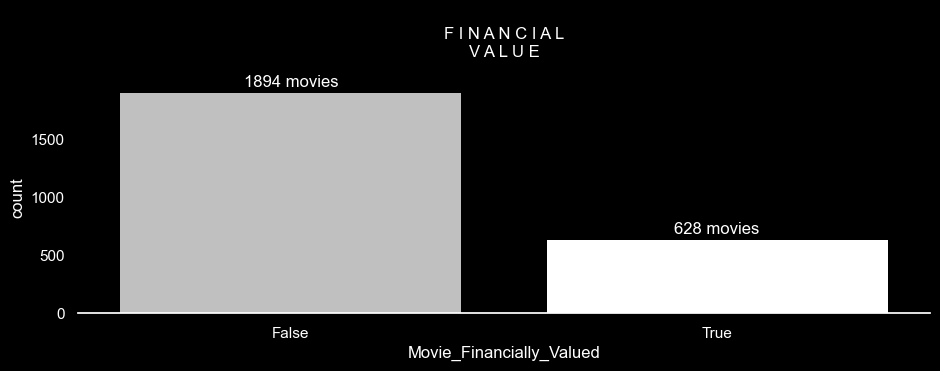
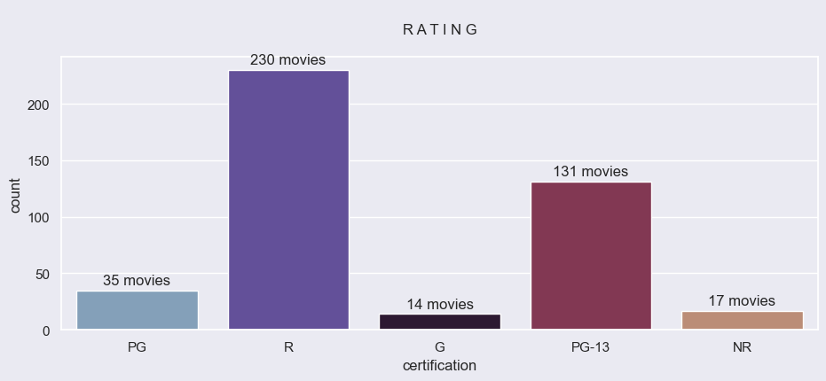
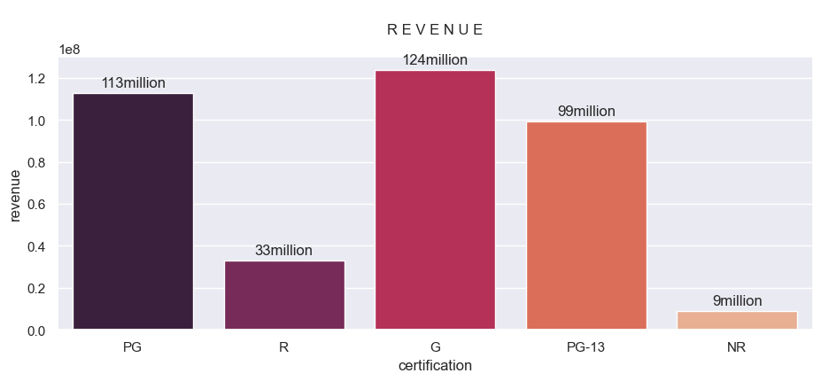
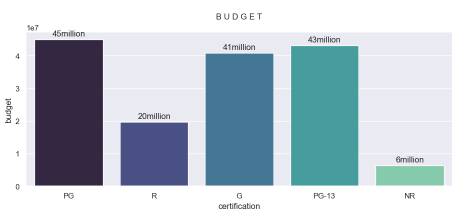
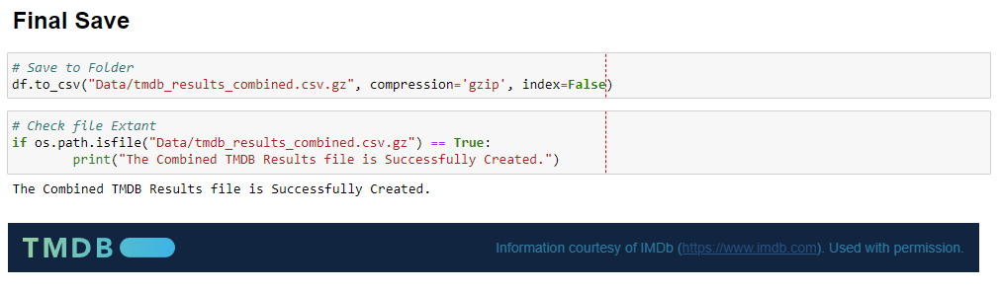

# 01.26-Week_13_Project-3-Suganthan_Thamotharampillai


## **Exploratory Data Analysis**

#### **Exploratory** Visualization


```python
## MOVIES GRAPH WITH FINANCIAL VALUES
plt.figure(facecolor='#000'); sns.set(rc = {'figure.figsize':(11,4)});
plt.style.use("dark_background"); plt.grid(visible=None);
sns.despine(left=True, top=True, right=True);
plotts = sns.countplot(data=df, x='Movie_Financially_Valued', palette = ['silver',"white"], linewidth=0) #['#432371',"#FAAE7B"]
for bar in plotts.patches:
    plotts.annotate(format(str(round(bar.get_height()))+' movies'),
                   (bar.get_x() + bar.get_width() / 2,
                   bar.get_height()), ha='center', va='center',
                   size=12, xytext=(0, 8),
                   textcoords='offset points');plt.title("\nF I N A N C I A L\nV A L U E\n");
```




```python
# RATING
plt.figure(facecolor='#eaeaf2'); sns.set(rc = {'figure.figsize':(10,5)});
sns.countplot(data=df, x=df['certification'], palette = "twilight").set(title='\nR A T I N G\n');
```




```python
# REVENUE
plots = sns.barplot(x="certification", y="revenue", data=df, palette = "rocket", errorbar=None);
for bar in plots.patches:
    plots.annotate(format(str(round(bar.get_height()/1000000))+'million'),
                   (bar.get_x() + bar.get_width() / 2,
                    bar.get_height()), ha='center', va='center',
                   size=12, xytext=(0, 8),
                   textcoords='offset points');plt.title("\nR E V E N U E\n")
```




```python
# BUDGET
plot = sns.barplot(x="certification", y="budget", data=df, palette = "mako", errorbar=None); 
for bar in plot.patches:
    plot.annotate(format(str(round(bar.get_height()/1000000))+'million'),
                   (bar.get_x() + bar.get_width() / 2,
                    bar.get_height()), ha='center', va='center',
                   size=12, xytext=(0, 8),
                   textcoords='offset points');plt.title("\nB U D G E T\n")
```



